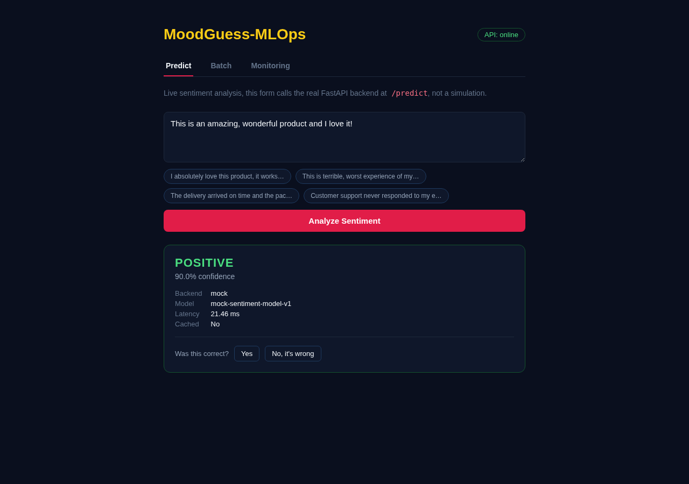
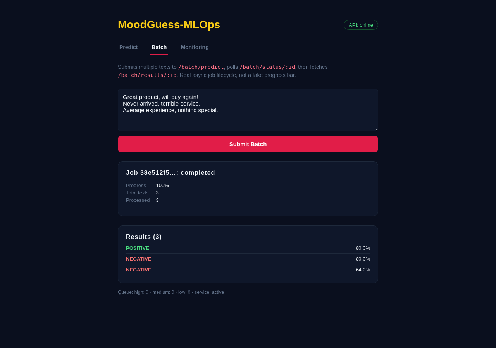
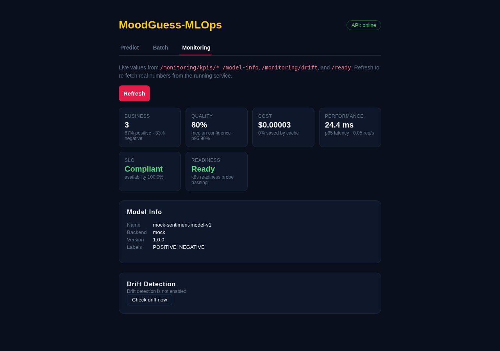
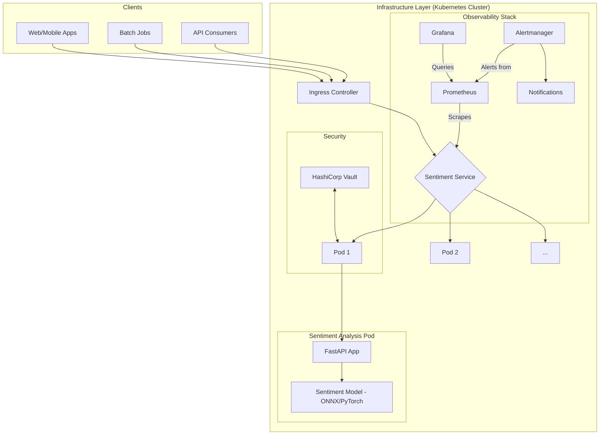

# MoodGuess-MLOps

<p align="center">
  
  
  
  
</p>

<p align="center">
  <strong>Production sentiment analysis on Kubernetes. Helm charts, HPA autoscaling, full observability</strong><br/>
  ONNX 160x faster cold-start · DistilBERT · Redis caching · Kafka async · Terraform multi-cloud IaC
</p>

<p align="center">
  
</p>

[](https://mlflow.org)
[](https://github.com/Hamilas/MoodGuess-MLOps)
[](https://moodguess-mlops-demo.vercel.app)

**MoodGuess** is a production-grade, scalable, and observable sentiment analysis microservice. Built with FastAPI and designed for Kubernetes, it embodies modern MLOps best practices from the ground up, providing a robust foundation for deploying machine learning models in a cloud-native environment.

## Screenshots

<table align="center">
  <tr>
    <td align="center" width="33%"><sub>Predict, real inference through the live API</sub></td>
    <td align="center" width="33%"><sub>Batch, real async job lifecycle</sub></td>
    <td align="center" width="33%"><sub>Monitoring, live business/quality/cost KPIs</sub></td>
  </tr>
  <tr>
    <td align="center" width="33%"></td>
    <td align="center" width="33%"></td>
    <td align="center" width="33%"></td>
  </tr>
</table>

## Why MoodGuess?

This project was built to serve as a comprehensive, real-world example of MLOps principles in action. It addresses common challenges in deploying ML models, such as:

- **Scalability**: Handles high-throughput inference with Kubernetes Horizontal Pod Autoscaling.
- **Observability**: Offers deep insights into model and system performance with a pre-configured monitoring stack.
- **Reproducibility**: Ensures consistent environments from development to production with Docker, Terraform, and Helm.
- **Security**: Integrates best practices for secret management, container security, and network policies.
- **Automation**: Features a complete CI/CD pipeline for automated testing and deployment.

## Key Features

- **High-Performance AI Inference**: Leverages state-of-the-art transformer models for real-time sentiment analysis.
- **GPU Acceleration & Multi-GPU Support**: Enterprise-grade GPU scheduling with dynamic batch optimization and load balancing for maximum throughput (800-3000 req/s per GPU).
- **ONNX Optimization**: Supports ONNX Runtime for accelerated inference and reduced resource consumption.
- **Cloud-Native & Kubernetes-Ready**: Designed for Kubernetes with auto-scaling, health checks, and zero-downtime deployments via Helm.
- **Full Observability Stack**: Integrated with Prometheus, Grafana, and structured logging for comprehensive monitoring.
- **Infrastructure as Code (IaC)**: Reproducible infrastructure defined with Terraform.
- **Automated CI/CD Pipeline**: GitHub Actions for automated testing, security scanning (Trivy), and deployment.
- **Secure by Design**: Integrates with HashiCorp Vault for secrets management and includes hardened network policies.
- **Comprehensive Benchmarking**: Includes a full suite for performance and cost analysis across different hardware configurations (CPU vs GPU).

## Architecture Overview

The system is designed as a modular, cloud-native application. At its core is the FastAPI service, which serves the sentiment analysis model. This service is containerized and deployed to a Kubernetes cluster, with a surrounding ecosystem for monitoring, security, and traffic management.



For a deeper dive into the technical design, components, and patterns used, please see the **[Architecture Document](docs/architecture.md)**.

## Getting Started

### Prerequisites

Ensure you have the following tools installed on your local machine:

- **Python 3.11+**
- **Docker & Docker Compose**
- **kubectl** (for Kubernetes interaction)
- **Helm 3+** (for Kubernetes package management)
- **make** (optional, for using Makefile shortcuts)

### 1. Local Development (Docker Compose)

This is the quickest way to get the service running on your local machine.

1.  **Clone the repository:**
    ```bash
    git clone https://github.com/Hamilas/MoodGuess-MLOps.git
    cd MoodGuess-MLOps
    ```

2.  **Install dependencies:**
    ```bash
    # Core dependencies
    pip install -r requirements.txt

    # Development tools (linting, formatting, type checking)
    pip install -r requirements-dev.txt

    # Testing dependencies
    pip install -r requirements-test.txt

    # Cloud-specific dependencies (install as needed):
    # AWS: pip install -r requirements-aws.txt
    # GCP: pip install -r requirements-gcp.txt
    # Azure: pip install -r requirements-azure.txt

    # Or use the Makefile shortcut:
    make install-dev
    ```

    > **Tip:** You can also use our setup script to automate virtual environment creation and dependency installation:
    > ```bash
    > python scripts/setup/setup_dev_environment.py
    > ```

3.  **Build the service:**
    The project includes multiple Dockerfiles for different use cases (see [Dockerfile Guide](docs/docker/DOCKERFILE_GUIDE.md)).
    ```bash
    # Standard development build
    make build-dev
    ```

4.  **Start the service:**
    ```bash
    docker-compose up --build
    ```
    This will build the Docker image and start the FastAPI service.

4.  **Test the service:**
    Open a new terminal and send a prediction request:

    > **Note on Ports:** The application runs on port 8000 inside the container.
    > `docker-compose.yml` maps this to `localhost:5080` for local development.
    > In Kubernetes, use `kubectl port-forward` to map to any local port.

    > **Note on Auth:** The local dev stack requires an API key
    > (`MLOPS_API_KEY=MoodGuessDemo2024`, set in `docker-compose.yml`).

    ```bash
    curl -X POST "http://localhost:5080/predict" \
         -H "Content-Type: application/json" \
         -H "X-API-Key: MoodGuessDemo2024" \
         -d '{"text": "This is an amazing project and the setup was so easy!"}'
    ```

    You should receive a response like (the local dev stack uses the mock
    backend by default, see `MLOPS_MODEL_BACKEND` in `docker-compose.yml`):
    ```json
    {
      "label": "POSITIVE",
      "score": 0.82,
      "inference_time_ms": 22.7,
      "model_name": "mock-sentiment-model-v1",
      "text_length": 54,
      "backend": "mock",
      "cached": false
    }
    ```

5.  **Open the frontend:**
    `docker-compose up` also starts a React 18 UI at **http://localhost:5173**,
    calling the real API directly (not a simulation). It has three tabs:
    - **Predict**: analyze text, see label/confidence/latency/cache status, submit feedback
    - **Batch**: submit multiple texts to `/batch/predict`, poll job status, view results
    - **Monitoring**: live business/quality/cost/performance/SLO KPIs, model info, drift detection

    Source lives in `frontend/` (Vite + React 18, no build step needed for local dev).

### 2. Full Kubernetes Deployment with Monitoring

To experience the full MLOps stack, including the monitoring dashboard, you can deploy the entire system to a Kubernetes cluster (e.g., Minikube, kind, or a cloud provider's cluster).

Our **[Quick Start Guide](docs/setup/QUICKSTART.md)** provides a one-line script to get the application and its full monitoring stack running in minutes.

```bash
# Follow the instructions in the Quick Start guide
./scripts/infra/setup-monitoring.sh
```

This will deploy the application along with Prometheus for metrics, Grafana for dashboards, and Alertmanager for alerts.

## Usage

### API Endpoints

The service exposes several key endpoints:

| Method | Endpoint              | Description                                      |
|--------|-----------------------|--------------------------------------------------|
| `POST` | `/api/v1/predict`            | Analyzes the sentiment of the input text.        |
| `POST`   | `/api/v1/batch/predict`      | Submits a batch of texts for asynchronous prediction. |
| `GET`    | `/api/v1/batch/status/{job_id}` | Checks the status of a batch prediction job.      |
| `GET`    | `/api/v1/batch/results/{job_id}`| Retrieves the results of a completed batch job. |
| `GET`  | `/api/v1/health`             | Health check endpoint for readiness/liveness.    |
| `GET`  | `/api/v1/metrics`            | Exposes Prometheus metrics.                      |
| `GET`  | `/api/v1/model-info`  | Returns metadata about the loaded ML model.      |

> **Note on API Versioning:** All endpoints use the `/api/v1` prefix in production mode. When running in debug mode (`MLOPS_DEBUG=true`), the `/api/v1` prefix is omitted for easier local development (e.g., `/predict` instead of `/api/v1/predict`).

### Configuration

The application uses a **profile-based configuration system** (see ADR-009) with comprehensive documentation. For complete configuration setup, see **[docs/configuration/](docs/configuration/)**.

**Quick Links:**
- **[Quick Start](docs/configuration/QUICK_START.md)** - Get running in 5 minutes
- **[Environment Variables](docs/configuration/ENVIRONMENT_VARIABLES.md)** - Complete reference
- **[Deployment Guide](docs/configuration/DEPLOYMENT.md)** - Environment-specific configurations
- **[Profiles](docs/configuration/PROFILES.md)** - Profile-based defaults

> **Note:** `.env` files are intentionally _not_ baked into the container image. Provide any sensitive or environment-specific settings at runtime using the mechanisms supported by your orchestrator.

#### Quick Configuration

```bash
# Set profile (applies 50+ defaults automatically)
export MLOPS_PROFILE=development  # or local, staging, production

# Override specific settings as needed
export MLOPS_REDIS_HOST=my-redis-server
```

#### Supplying configuration at runtime

- **Docker / Docker Compose:** pass variables with `--env-file` or individual `-e` flags when running the container.
- **Kubernetes:** mount configuration with `envFrom` or `env` entries sourced from a `ConfigMap` or `Secret`. Sensitive values (API keys, credentials) should be stored in a `Secret`, while non-sensitive defaults can live in a `ConfigMap`.

Example Kubernetes manifest snippet:

```yaml
envFrom:
  - configMapRef:
      name: mlops-sentiment-config
  - secretRef:
      name: mlops-sentiment-secrets
```

This approach keeps secrets out of the image and allows you to tailor configuration per environment (dev/staging/prod) without rebuilding the container.

## Benchmarking

A key part of this project is its ability to measure performance and cost-effectiveness. The `benchmarking/` directory contains a powerful suite for running load tests against the service on different hardware configurations.

This allows you to answer questions like:
- "Is a GPU instance more cost-effective than a CPU instance for my workload?"
- "What is the maximum RPS our current configuration can handle?"

The benchmarking scripts generate a comprehensive HTML report with performance comparisons, cost analysis, and resource utilization charts. See the **[Benchmarking README](benchmarking/README.md)** for more details.

### Latest Kafka Consumer Benchmark Snapshot

| Scenario | Batch Size | Messages Processed | Wall Time (s) | Approx. Throughput (msg/s) |
|----------|------------|--------------------|----------------|-----------------------------|
| Synthetic workload executed with the in-repo `MockModel` using the high-throughput Kafka consumer (no external brokers) | 1,000 | 1,000 | 0.0095 | ~105,700 |

> **How it was measured:** the `benchmarking/` helper script instantiates `HighThroughputKafkaConsumer` with the same `MockModel` used in the test suite and processes 1,000 synthetic messages in a single batch. This mirrors the high-throughput path without requiring a live Kafka cluster, making it reproducible in constrained environments.

> **Tip:** For end-to-end benchmarks against a running Kafka cluster, use `benchmarking/kafka_performance_test.py`. It exercises producer/consumer I/O, DLQ handling, and Prometheus instrumentation at scale.

## Author

**Rayen Lassoued**
[github.com/Hamilas](https://github.com/Hamilas) | [LinkedIn](https://www.linkedin.com/in/lassoued-rayen/)
